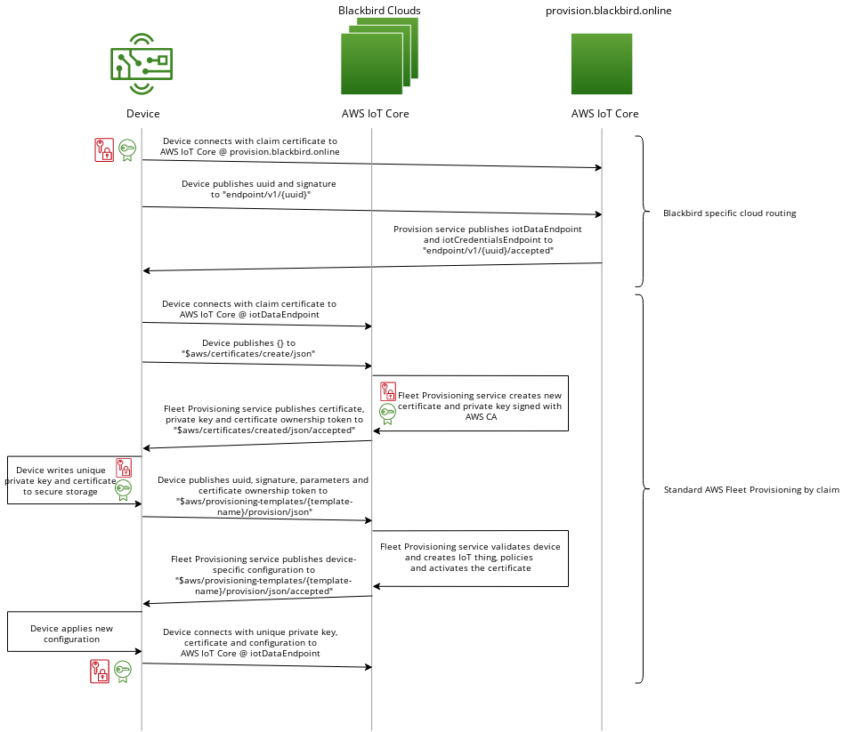

# Factbird Fleet Provisioning Plugin

[](https://github.com/FactbirdHQ/fb-provision/actions/workflows/ci.yml)

AWS Greengrass [trusted plugin][gg-plugin] that provisions a device into
the Factbird fleet using a routing layer on top of the
[AWS Fleet Provisioning Service][aws-fp].

The device proves its hardware identity with a pre-registered claim
certificate, learns which tenant account it belongs to from the
fleet-management Router, and obtains a tenant-issued production
certificate via AWS IoT custom-authorizer fleet provisioning. The
fleet-management cloud and the tenant cloud are different AWS accounts;
no cross-account calls happen inside the provisioning Lambdas — the
provisioning token signed by KMS in the fleet-management account is
verified locally by a custom authorizer in the tenant account.



## Flow

1. **Routing.** Connect mTLS (claim cert) to the claim broker
   (`provisionEndpoint`). Publish `provision/{uuid}/request` with
   `{uuid, signature}`. Subscribe to `provision/{uuid}/response`. The
   Router publishes a success payload (`iotDataEndpoint`,
   `iotCredentialsEndpoint`, `provisioningToken`) or an error.
   - On error (e.g. "device not claimed"), the subscription stays open.
     A DynamoDB-stream-driven `claim_reactor` pushes the success
     payload when the claim transition fires, so the device proceeds
     the instant ops claims it — no polling.
2. **Provisioning via custom authorizer.** Open a new MQTT connection
   to the returned `iotDataEndpoint` on port 443 with ALPN `mqtt`, no
   client cert, username = uuid, password = `<sig-hex>:<token-b64>`.
   The tenant-side custom authorizer verifies the KMS-signed token
   locally (no cross-account call), then runs the standard
   `CreateCertificateFromCsr` + `RegisterThing` fleet provisioning
   exchange.
3. **Production.** Reconnect to the same endpoint with mTLS using the
   freshly issued production certificate; ALPN `x-amzn-mqtt-ca`.

## Plugin parameters

### Required
| Name | Description |
| ---- | ----------- |
| `provisionEndpoint` | Claim broker endpoint (`provision.factbird.com`). |
| `provisioningTemplate` | Name of the AWS IoT provisioning template registered in the tenant account. |
| `claimCertificatePath` | Path / PKCS11 URI of the claim certificate on the device. |
| `claimCertificatePrivateKeyPath` | Path / PKCS11 URI of the claim private key. |
| `signPrivateKeyPath` | Path / PKCS11 URI of the identity private key. Its public key is registered on the device record at factory time; the Router verifies the UUID signature against it. |
| `rootCaPath` | Path of the AWS root CA used for TLS server validation. |
| `rootPath` | Greengrass root directory. |
| `mqttPort` | MQTT port. |

### Optional
| Name | Description |
| ---- | ----------- |
| `templateParameters` | `Map<String, String>` of parameters forwarded to the provisioning template. The plugin always adds `uuid` and `signature`. |
| `awsRegion` | AWS region for the tenant account. |
| `iotRoleAlias` | Role alias used by Greengrass TES. |
| `useTpmProvisioning` | When `true`, generate the production keypair inside a PKCS11 HSM and submit a CSR. When `false`, use AWS IoT `createKeysAndCertificate`. |
| `pkcs11Library` / `pkcs11Slot` / `pkcs11UserPin` | PKCS11 library, slot, and PIN when `useTpmProvisioning=true`. |
| `proxyUrl` / `proxyUsername` / `proxyPassword` | Optional HTTP(S) proxy. |

## Build

```sh
mvn package
```

Produces `target/FleetProvisioningByClaim.jar`. The JAR targets
Java 8 bytecode and runs on the device's Amazon Corretto 11 runtime.
Local builds run on JDK 11 or newer (Lombok is wired up via
`annotationProcessorPaths`).

## Test

```sh
mvn test
```

## Install on Greengrass

```sh
sudo -E java -Dlog.store=FILE -jar ./GreengrassCore/lib/Greengrass.jar \
    -i <secure_path_to_config>/config.yaml \
    --trusted-plugin <secure_path_to_plugin_jar>/FleetProvisioningByClaim.jar \
    -r /home/ec2-user/demo/greengrass/v2
```

## License

This project is licensed under the Apache-2.0 License. Originally
forked from [aws-greengrass/aws-greengrass-fleet-provisioning-by-claim][upstream].

[gg-plugin]: https://github.com/aws-greengrass/aws-greengrass-nucleus
[aws-fp]: https://docs.aws.amazon.com/iot/latest/developerguide/provision-wo-cert.html
[upstream]: https://github.com/aws-greengrass/aws-greengrass-fleet-provisioning-by-claim
